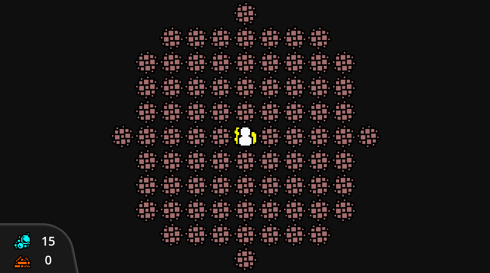

# After the End
> Your shuttle has crashlanded on a derelict rim world, and now you have to find your way out.
> Collect scrap from the planets surface, fight off aliens, trade with locals, and make your way home.

## Goals
The prototype for this project was thrown together over the course of 5 hours after a stroke of inspiration.
After cleaning up the architecture some, I also decided to try implementing a Domain Specific Language for event scripting in GDScript, which so far has turned out great.
I'm still looking to implement some UI functions, conditionals and control flow, and variables into the scripting language, but the core of the project is mostly complete,
it just needs some polish and some content.

I'm also looking to implement mod authoring and loading to the game to server as a basis for creating more games in the style in the future, including one of my other projects, These Hills.

## Main Mechanics
- Gather SCRAP to fix your downed shuttle in the center of the map
- Takes 1 O2 to move to a tile
- Tile Types:
	- Encounter:
		- Roll d6 against enemy d6, -1 HP to lower.
		- `-1 O2 x RING` on loss, otherwise `+1 SCRAP x RING`
		- At `0 HP`, player dies.
	- SCRAP pile: `+2 SCRAP x RING`, exhaust tile on use
	- O2 cache: `+2 O2 x RING`, does not exhaust on use
	- MERCHANT: `-1 02 x RING` for `+1 SCRAP x RING` and vice versa
- On return to ship, clear board and begin new day.
- Once `15 SCRAP` is found, ship is fixed and the game is won

## Stretch Goals
- DUNGEON tile:
	- Sub-terranian lair with extra loot, and enemies. Exhausts on use.
- Items:
	- Laser Pistol:
		- +1 to attack roll
	- Kevlar Vest:
		- -1 to Enemy attack roll
